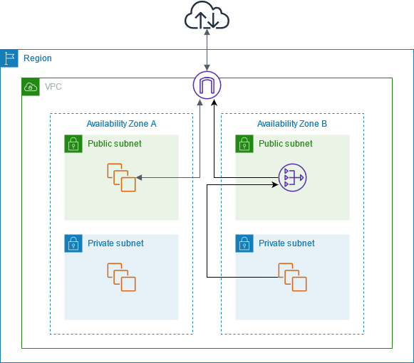
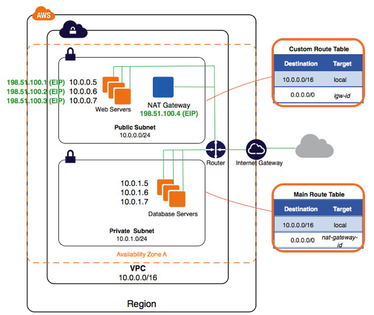

# Network Address Translation (NAT)

A `NAT` gateway is a Network Address Translation (NAT) service. You can use a NAT gateway so that instances in a private subnet can connect to services outside your VPC but external services cannot initiate a connection with those instances.

When you create a NAT gateway, you specify one of the following connectivity types:

1. Public – (Default):
   - Instances in private subnets can connect to the internet through a public NAT gateway, but cannot receive unsolicited inbound connections from the internet.
   - You create a public NAT gateway in a public subnet and must associate an elastic IP address with the NAT gateway at creation.
   - You route traffic from the NAT gateway to the internet gateway for the VPC.
   - Alternatively, you can use a public NAT gateway to connect to other VPCs or your on-premises network.

In this case, you route traffic from the NAT gateway through a transit gateway or a virtual private gateway.

2. Private –
   - Instances in private subnets can connect to other VPCs or your on-premises network through a private NAT gateway.
   - You can route traffic from the NAT gateway through a transit gateway or a virtual private gateway.
   - You cannot associate an elastic IP address with a private NAT gateway.
   - You can attach an internet gateway to a VPC with a private NAT gateway, but if you route traffic from the private NAT gateway to the internet gateway, the internet gateway drops the traffic.

## NAT gateway basics

Each NAT gateway is created in a specific Availability Zone and implemented with redundancy in that zone. There is a quota on the number of NAT gateways that you can create in each Availability Zone. 

If you have resources in multiple Availability Zones and they share one NAT gateway, and if the NAT gateway’s Availability Zone is down, resources in the other Availability Zones lose internet access. To improve resiliency, create a NAT gateway in each Availability Zone, and configure your routing to ensure that resources use the NAT gateway in the same Availability Zone.

- A NAT gateway supports the following protocols: TCP, UDP, and ICMP.

- NAT gateways are supported for IPv4 or IPv6 traffic. For IPv6 traffic, NAT gateway performs NAT64. By using this in conjunction with DNS64 (available on Route 53 resolver), your IPv6 workloads in a subnet in Amazon VPC can communicate with IPv4 resources. These IPv4 services may be present in the same VPC (in a separate subnet) or a different VPC, on your on-premises environment or on the internet.

- A NAT gateway supports 5 Gbps of bandwidth and automatically scales up to 100 Gbps. If you require more bandwidth, you can split your resources into multiple subnets and create a NAT gateway in each subnet.

- A NAT gateway can process one million packets per second and automatically scales up to ten million packets per second. Beyond this limit, a NAT gateway will drop packets. To prevent packet loss, split your resources into multiple subnets and create a separate NAT gateway for each subnet.

- Each IPv4 address can support up to 55,000 simultaneous connections to each unique destination. A unique destination is identified by a unique combination of destination IP address, the destination port, and protocol (TCP/UDP/ICMP). You can increase this limit by associating up to 8 IPv4 addresses to your NAT Gateways (1 primary IPv4 address and 7 secondary IPv4 addresses). You are limited to associating 2 Elastic IP addresses to your public NAT gateway by default. You can increase this limit by requesting a quota adjustment. For more information, see Elastic IP addresses.

- You can pick the private IPv4 address to assign to the NAT gateway or have it automatically assigned from the IPv4 address range of the subnet. The assigned private IPv4 address persists until you delete the private NAT gateway. You cannot detach the private IPv4 address and you cannot attach additional private IPv4 addresses.

- You cannot associate a security group with a NAT gateway. You can associate security groups with your instances to control inbound and outbound traffic.

- You can use a network ACL to control the traffic to and from the subnet for your NAT gateway. NAT gateways use ports 1024–65535. For more information, see Control subnet traffic with network access control lists.

- A NAT gateway receives a network interface. You can pick the private IPv4 address to assign to the interface or have it automatically assigned from the IPv4 address range of the subnet. You can view the network interface for the NAT gateway using the Amazon EC2 console. For more information, see Viewing details about a network interface. You cannot modify the attributes of this network interface.

- You can't route traffic to a NAT gateway through a VPC peering connection. You can't route traffic through a NAT Gateway when traffic arrives over a hybrid connection (Site to Site VPN or Direct Connect) through a Virtual Private Gateway. You can route traffic through a NAT Gateway when traffic arrives over a hybrid connection (Site to Site VPN or Direct Connect) through a transit gateway.